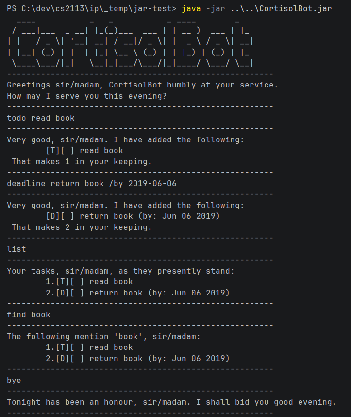

# CortisolBot

CortisolBot is a task tracker for your terminal, with the manners of a very expensive butler. It
keeps your todos, deadlines and events, remembers them between sessions, and declines to panic on
your behalf.

<!-- Add a terminal screenshot here as docs/Ui.png, then replace this comment with:
      -->

```
  ____           _   _           _ ____        _
 / ___|___  _ __| |_(_)___  ___ | | __ )  ___ | |_
| |   / _ \| '__| __| / __|/ _ \| |  _ \ / _ \| __|
| |__| (_) | |  | |_| \__ \ (_) | | |_) | (_) | |_
 \____\___/|_|   \__|_|___/\___/|_|____/ \___/ \__|
-------------------------------------------------------
Greetings sir/madam, CortisolBot humbly at your service.
How may I serve you this evening?
-------------------------------------------------------
```

## Quick start

1. Make sure you have **Java 25** or later. Check with `java -version`.
2. Download `CortisolBot.jar` from the [latest release](https://github.com/PoonnatW/ip/releases).
3. Put the jar in a folder of its own — CortisolBot saves your tasks into the folder you run it
   from, so a folder of its own keeps things tidy.
4. Open a terminal in that folder and run:

   ```
   java -jar CortisolBot.jar
   ```

5. Type a command, press Enter, and the butler will see to it. Try `todo read book`, then `list`.
6. Type `bye` when you are done. Your tasks are already saved.

## Features

Commands are a single word, sometimes followed by details. Words in `UPPER_CASE` are yours to fill
in.

### Adding a todo: `todo`

Something to do, with no particular date attached.

Format: `todo DESCRIPTION`

```
todo read book
-------------------------------------------------------
Very good, sir/madam. I have added the following:
	[T][ ] read book
 That makes 1 in your keeping.
-------------------------------------------------------
```

### Adding a deadline: `deadline`

Something due at a particular date, and optionally at a particular hour.

Format: `deadline DESCRIPTION /by DATE`

`DATE` must be written as `2019-06-06`, or as `2019-12-02 1800` if the hour matters. CortisolBot
reads it back to you in a friendlier form.

```
deadline return book /by 2019-06-06
-------------------------------------------------------
Very good, sir/madam. I have added the following:
	[D][ ] return book (by: Jun 06 2019)
 That makes 2 in your keeping.
-------------------------------------------------------

deadline submit form /by 2019-12-02 1800
-------------------------------------------------------
Very good, sir/madam. I have added the following:
	[D][ ] submit form (by: Dec 02 2019, 6:00pm)
 That makes 3 in your keeping.
-------------------------------------------------------
```

Anything else — `next Tuesday`, `June 6th` — is politely refused:

```
deadline return book /by June 6th
-------------------------------------------------------
 I cannot make out 'June 6th' as a date, sir/madam.
 Do try: 2019-12-02, or 2019-12-02 1800 if an hour matters.
-------------------------------------------------------
```

### Adding an event: `event`

Something that runs from one time to another.

Format: `event DESCRIPTION /from START /to END`

An event's start and end are kept as you write them, so anything readable will do.

```
event project meeting /from Aug 6th 2pm /to 4pm
-------------------------------------------------------
Very good, sir/madam. I have added the following:
	[E][ ] project meeting (from: Aug 6th 2pm to: 4pm)
 That makes 4 in your keeping.
-------------------------------------------------------
```

### Listing your tasks: `list`

Shows everything, in the order you added it. The numbers here are the ones `mark`, `unmark` and
`delete` expect.

Format: `list`

```
list
-------------------------------------------------------
Your tasks, sir/madam, as they presently stand:
	1.[T][ ] read book
	2.[D][ ] return book (by: Jun 06 2019)
	3.[D][ ] submit form (by: Dec 02 2019, 6:00pm)
	4.[E][ ] project meeting (from: Aug 6th 2pm to: 4pm)
-------------------------------------------------------
```

The letter says what kind of task it is — `[T]` todo, `[D]` deadline, `[E]` event — and `[X]` marks
one as done.

### Marking a task done, or not: `mark`, `unmark`

Format: `mark NUMBER` and `unmark NUMBER`, where `NUMBER` is the one shown by `list`.

```
mark 1
-------------------------------------------------------
Consider it done, sir/madam:
	[T][X] read book
-------------------------------------------------------
```

`unmark 1` puts it back to not done. Marking something twice does no harm.

### Finding tasks: `find`

Searches task descriptions for a word or phrase. Capitalisation does not matter, so `find BOOK`
finds `read book`.

Format: `find KEYWORD`

```
find book
-------------------------------------------------------
The following mention 'book', sir/madam:
	1.[T][X] read book
	2.[D][ ] return book (by: Jun 06 2019)
-------------------------------------------------------
```

**The numbers in a search result count the matches, not your whole list.** To mark or delete
something you found, run `list` first and use the number from there.

### Deleting a task: `delete`

Format: `delete NUMBER`

```
delete 4
-------------------------------------------------------
Consider it forgotten, sir/madam:
	[E][ ] project meeting (from: Aug 6th 2pm to: 4pm)
 That leaves 3 in your keeping.
-------------------------------------------------------
```

There is no undo, so do check the number first.

### Leaving: `bye`

Format: `bye`

```
bye
-------------------------------------------------------
Tonight has been an honour, sir/madam. I shall bid you good evening.
-------------------------------------------------------
```

### Saving your tasks

There is no save command — CortisolBot writes to `data/cortisolbot.txt` after every change, inside
whichever folder you ran it from. Your list is simply there the next time you start it from the same
place.

The file is plain text and you may edit it by hand if you like. A line CortisolBot cannot understand
is set aside rather than discarded, and it will tell you how many it skipped:

```
 I could not read 1 of my records, sir/madam. I have set them aside.
 I have retrieved 2 of your tasks, sir/madam.
-------------------------------------------------------
```

## Command summary

| Action | Format | Example |
|---|---|---|
| Add a todo | `todo DESCRIPTION` | `todo read book` |
| Add a deadline | `deadline DESCRIPTION /by DATE` | `deadline return book /by 2019-06-06` |
| Add an event | `event DESCRIPTION /from START /to END` | `event project meeting /from Aug 6th 2pm /to 4pm` |
| List everything | `list` | `list` |
| Find by keyword | `find KEYWORD` | `find book` |
| Mark as done | `mark NUMBER` | `mark 1` |
| Mark as not done | `unmark NUMBER` | `unmark 1` |
| Delete | `delete NUMBER` | `delete 4` |
| Exit | `bye` | `bye` |

## Things worth knowing

- **Only deadlines take real dates.** An event's start and end are kept as text, so they are not
  checked and cannot be sorted or searched by date.
- **A `|` in a description does not survive a restart.** CortisolBot uses `|` to separate fields in
  its save file, so `todo read | book` comes back as `read` the next time you start it. Avoid the
  character until this is fixed.
- **`find` searches descriptions only**, not dates. `find 2019` finds nothing.
- **There is no undo.** `delete` is final, though an accidental `mark` is easily put right with
  `unmark`.
